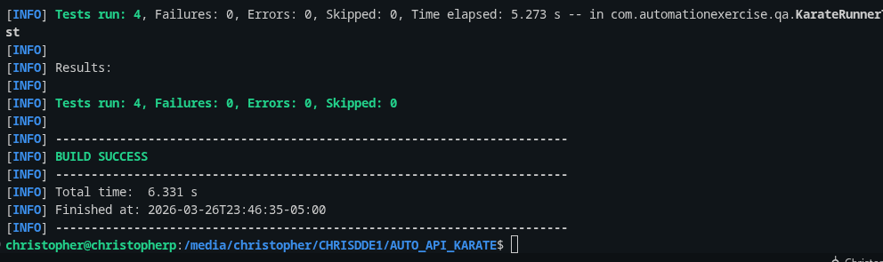
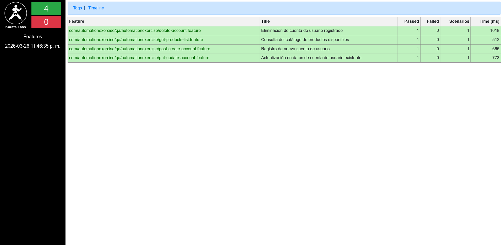

<div align="center">
  
# 🚀 AUTO_API_KARATE
### Entregable 2 (Fase 4) — Taller Semana 7: Expectativa vs. Realidad

**Autor:** Christopher Ismael Pallo Arias  
**Rol:** QA Automation Engineer  
**Proyecto:** Framework de automatización de pruebas de API construido con **Karate Framework** bajo un enfoque declarativo BDD, garantizando cobertura funcional y trazabilidad sobre los cuatro verbos HTTP principales (GET, POST, PUT, DELETE).

<br />

### 🛠️ Technology Stack

**Automation Framework**
<br />
<a href="https://skillicons.dev">
  
</a>
<br />
<br />
<a href="https://karatelabs.github.io/karate/">
  
</a>

**Application Under Test (REST API)**
<br />
<a href="https://www.automationexercise.com/api_list">
  
</a>

</div>

---

## 📋 Índice

- [Contexto del Reto](#-contexto-del-reto)
- [Entorno y Prerrequisitos](#-entorno-y-prerrequisitos-compatibilidad)
- [Escenarios API: Ciclo de Vida y Cobertura](#-escenario-api-ciclo-de-vida-y-cobertura)
- [Arquitectura del Framework](#-arquitectura-del-framework)
- [Cumplimiento de Rúbrica](#-cumplimiento-de-rúbrica-clean-code--karate-patterns)
- [Gestión de Configuración](#-gestión-de-configuración)
- [Instalación y Setup](#-instrucciones-de-clonado-y-setup-entorno-local)
- [Ejecución y Reportes](#-ejecución-y-generación-de-reportes)
- [Evidencia Visual](#-evidencia-visual)

---

## 🎯 Contexto del Reto

Este repositorio documenta el **Entregable 2 (Repositorio de Pruebas API)** correspondiente al **Taller Semana 7: Expectativa vs. Realidad — Ejecución Ágil, MVP y Estrategia de Pruebas**.

Dentro de las misiones del equipo, este proyecto da cumplimiento íntegro a la **Fase 4: Reto Técnico de Automatización API (Liderada por QA)**. La rúbrica exigía investigar, diseñar e implementar desde cero el framework **Karate**, aplicando sus convenciones oficiales (`karatelabs`) para estructurar 4 escenarios de prueba independientes. Los escenarios cubren de manera obligatoria los verbos `GET`, `POST`, `PUT`, y `DELETE`, apuntando a los endpoints de la API pública *automationexercise.com/api_list*.

---

## 🛠️ Entorno y Prerrequisitos (Compatibilidad)

> ⚠️ **El uso de estas versiones es estrictamente requerido para compilar el framework basando el ecosistema en Karate JUnit 5 estable.**

| Componente | Versión Requerida | Verificación |
|------------|------------------|--------------|
| **Java / JDK** | `17` (LTS) | `java -version` → `openjdk 17.x.x` |
| **Maven** | `3.8+` | `mvn -version` → `Apache Maven 3.8.x+` |

### Compatibilidad Java 17

El proyecto exige `maven.compiler.source = 17` y `maven.compiler.target = 17` dentro de `pom.xml`. Adicionalmente, se audita mediante el `maven-compiler-plugin`.

### Dependencia Estricta: Karate-JUnit5

El ecosistema descarta por completo `junit-vintage-engine` e implementa nativamente `karate-junit5:1.4.1`. Esto previene fallos de ciclo de vida cruzado entre JUnit 4 y JUnit 5, adaptando al framework a los estándares modernos.

---

## 🔄 Escenario API: Ciclo de Vida y Cobertura

El framework ejecuta transacciones HTTP sobre el catálogo base y gestiona peticiones **idempotentes** para el dominio de cuentas de usuario.

### Estrategia de Idempotencia (Clean Data)

Todas las transacciones de modificación de estado (`POST`, `PUT`, `DELETE`) instancian un contexto limpio para evitar colisiones:
1. Generación de **correo dinámico** mediante `java.lang.System.currentTimeMillis()`.
2. Las transacciones de Creación y Actualización eliminan el registro (cleanup) dentro del mismo escenario `Feature`.

*Ejemplo dinámico generado en runtime:*
```text
christophersofka_1741654000000@test.com
```

### Análisis de los 4 Escenarios Automatizados

A continuación se detalla la lógica de los 4 features principales operando en tiempo real contra la API objetivo. Cada escenario expone su propia dinámica y el ciclo de vida gestionado por Karate (Setup ➜ HTTP Request ➜ Assertions ➜ Cleanup).

<details>
<summary><b>1. Método GET: Consulta de Catálogo (get-products-list.feature)</b></summary>

Validación de esquemas y tipos de datos del JSON de respuesta (*Fuzzy Matching* nativo de Karate).

```gherkin
@get
Feature: Consulta del catálogo de productos disponibles

  Scenario: Obtener todos los productos y validar la estructura de la respuesta
    Given url baseUrl
    And path '/api/productsList'
    When method GET
    Then status 200
    And match response.responseCode == 200
    
    # Validación Estructural de Tipos y Schema
    And match response.products == '#array'
    And match response.products[0].id == '#number'
    And match response.products[0].name == '#string'
    And match response.products[0].category == '#object'
```
</details>

<details>
<summary><b>2. Método POST: Petición Estocástica y Cleanup (post-create-account.feature)</b></summary>

Inyección de datos generados en runtime y limpieza asíncrona dentro de la misma ejecución.

```gherkin
@post
Feature: Registro de nueva cuenta de usuario

  Scenario: Crear un usuario con datos dinámicos y validar la confirmación
    * def timestamp = '' + java.lang.System.currentTimeMillis()
    * def email = 'christophersofka_' + timestamp + '@test.com'

    Given url baseUrl
    And path '/api/createAccount'
    And form field name = 'Christopher Sofka'
    And form field email = email
    And form field password = 'Test@1234'
    # ... (12 campos adicionales requeridos parseados vía form-data)
    When method POST
    Then status 200
    And match response.responseCode == 201
    And match response.message == 'User created!'

    # Cleanup Automático Inter-Escenario
    Given url baseUrl
    And path '/api/deleteAccount'
    And form field email = email
    And form field password = 'Test@1234'
    When method DELETE
    Then status 200
```
</details>

<details>
<summary><b>3. Método PUT: Modificación Asíncrona (put-update-account.feature)</b></summary>

Provisión, alteración transaccional y validación de impacto real sobre el perfil.

```gherkin
@put
Feature: Actualización de datos de cuenta de usuario existente

  Scenario: Crear usuario, actualizar sus datos y validar estado final
    * def timestamp = '' + java.lang.System.currentTimeMillis()
    * def email = 'christophersofka_' + timestamp + '@test.com'

    # Setup: Provisión inicial del recurso
    Given url baseUrl
    And path '/api/createAccount'
    And form field email = email
    # ... (form-data base)
    When method POST
    And match response.responseCode == 201

    # Transacción Pura: Editar campos
    Given url baseUrl
    And path '/api/updateAccount'
    And form field name = 'Christopher Sofka Updated'
    And form field email = email
    # ... (form-data de modificación)
    When method PUT
    Then status 200
    And match response.responseCode == 200
    And match response.message == 'User updated!'

    # Cleanup: Liberación del recurso original
    Given url baseUrl
    And path '/api/deleteAccount'
    And form field email = email
    And form field password = 'Test@1234'
    When method DELETE
```
</details>

<details>
<summary><b>4. Método DELETE: Supresión Total (delete-account.feature)</b></summary>

Comprobación de eliminación atómica mitigando fuga de datos de prueba en backend.

```gherkin
@delete
Feature: Eliminación de cuenta de usuario registrado

  Scenario: Crear usuario y eliminar la cuenta logrando confirmación de baja
    * def timestamp = '' + java.lang.System.currentTimeMillis()
    * def email = 'christophersofka_' + timestamp + '@test.com'

    # Setup Pre-Condicional (Dependencia temporal)
    Given url baseUrl
    And path '/api/createAccount'
    And form field email = email
    # ... (form-data)
    When method POST

    # Acción de Limpieza Base
    Given url baseUrl
    And path '/api/deleteAccount'
    And form field email = email
    And form field password = 'Test@1234'
    When method DELETE
    Then status 200
    
    # Aserción Absoluta
    And match response.responseCode == 200
    And match response.message == 'Account deleted!'
```
</details>

### Endpoints Automatizados

| Verbo HTTP | Endpoint | Objetivo Validado |
|---|---|---|
| **GET** | `/api/productsList` | Validación de Catálogo (HTTP 200, Arrays, Schema structure). |
| **POST** | `/api/createAccount` | Registro completo de usuario, validando HTTP 201 y mensaje `User created!`. |
| **PUT** | `/api/updateAccount` | Actualización de perfil instanciado, validando HTTP 200 y `User updated!`. |
| **DELETE** | `/api/deleteAccount` | Limpieza controlada de cuentas, rastreando HTTP 200 y confirmation message. |

---

## 🏗️ Arquitectura del Framework

El repositorio ha sido moldeado según la taxonomía oficial exigida por KarateLabs:

| Capa / Archivos | Ruta | Responsabilidad |
|---|---|---|
| ⚙️ **Configuración Global** | `karate-config.js` | Inyección de `baseUrl` y perfilado de `env` (dev/qa/prod). |
| 🚀 **Runners** | `KarateRunnerTest.java` | Entrypoint JUnit 5 para lanzar contextos concurrentes. |
| 📜 **Specs (Features)** | `automationexercise/` | Archivos Gherkin declarativos agrupando escenarios HTTP. |
| 📦 **Dependencias** | `pom.xml` | Orquestación de dependencias libres de XML conflictivo. |

```text
src/test/java/
├── karate-config.js
└── com/automationexercise/qa/
    ├── KarateRunnerTest.java
    └── automationexercise/
        ├── get-products-list.feature
        ├── post-create-account.feature
        ├── put-update-account.feature
        └── delete-account.feature
```

---

## 🏆 Cumplimiento de Rúbrica (Clean Code & Karate-Patterns)

- [x] **URL Relativas:** Archivos de prueba purgados de subdominios hardcodeados. Utilizan `url baseUrl` + `path '/api/...'`.
- [x] **Convenciones de Verbos:** Clasificación sistemática usando tags globales (`@get`, `@post`, `@put`, `@delete`).
- [x] **Asserts Estructurales:** Identificación fuerte sobre `responseCode` embebido en JSON y la aserción de Fuzzy Matchers sobre tipos de array/objeto.
- [x] **Nomenclatura Semántica en Inglés:** Identificadores y convenciones estructuradas para emular corporatividad global.

---

## ⚙️ Gestión de Configuración

### `karate-config.js`

| Propiedad | Valor | Propósito |
|-----------|-------|-----------|
| `env` | `dev` (default) | Variable habilitadora de multientornos. |
| `baseUrl` | `https://www.automationexercise.com` | End-point maestro aprovisionado globalmente. |

### `pom.xml`

| Aspecto | Detalle |
|---------|---------|
| **Karate Core** | `1.4.1` (Versión estable garantizada en Maven Central) |
| **Java** | `17` |
| **Surefire Plugin** | `3.2.5` con passthrough dinámico para `karate.options` |

---

## ⚡ Instrucciones de Clonado y Setup (Entorno Local)

### Paso 1: Clonar el Repositorio de Pruebas

```bash
git clone https://github.com/ChristopherPalloArias/AUTO_API_KARATE.git
cd AUTO_API_KARATE
```

### Paso 2: Verificación Base

Ejecuta el ciclo de vida `clean` en conjunto con la fase `test` para forzar la resolución de artefactos de Maven:

```bash
mvn clean test
```

> 🕒 **Nota Crítica:** Verifica que posees acceso irrestricto mediante puerto 443 hacia el dominio `automationexercise.com` antes de ejecutar.

---

## ▶️ Ejecución y Generación de Reportes

Para auditar y depurar la aplicación dinámicamente:

### Ejecución de la Suite E2E Completa

```bash
mvn clean test
```

### Ejecución Modular vía Tags

El `maven-surefire-plugin` fue parametrizado para atrapar opciones por consola:

```bash
mvn test -Dkarate.options="--tags @get"
mvn test -Dkarate.options="--tags @post"
mvn test -Dkarate.options="--tags @put"
mvn test -Dkarate.options="--tags @delete"
```

### Living Documentation (Reporte HTML)

Al concluir el *Build*, Karate sintetiza métricas nativas y gráficas de recurrencia mediante su generador de reportes embebido:

* **Ubica el index maestro en:**
  ```text
  target/karate-reports/karate-summary.html
  ```
*(Abre el archivo desde tu explorador web de preferencia).*

---

## 📸 Evidencia Visual

A continuación, se presentan las capturas validando la integración y comportamiento de la suite localmente.

### 1. Console Output


### 2. Reporte de Karate


> *Nota: Para generar o regenerar este reporte en tu entorno local tras un `mvn clean test`, puedes abrir directamente:*
> `target/karate-reports/karate-summary.html` *en tu navegador predilecto.*
